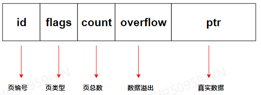
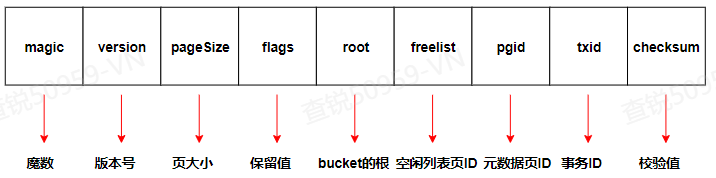
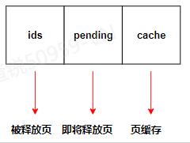
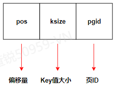
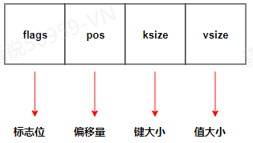
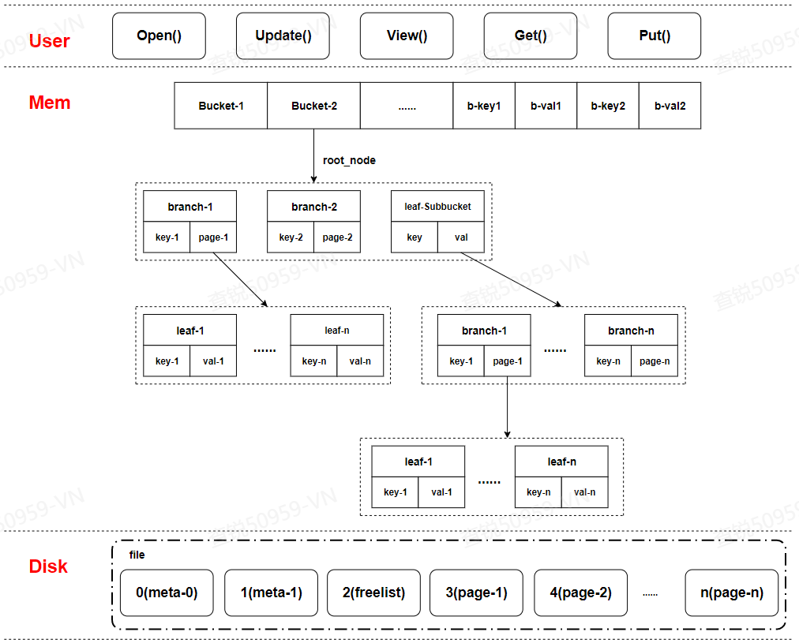

##### <font color=red>(若图片无法加载，请配置本地hosts文件，重新声明DNS，...... 或者直接科学上网！)</font>
# **BoltDB存储引擎**
### **0x00 前言**
```
采用B+Tree，基于LMDB及K/V模型实现的单点文件型存储引擎
```
### **0x01 源码地址**
```
https://github.com/boltdb/bolt
https://github.com/etcd-io/bbolt
```
### **0x02 存储机制**
##### 2.1> 名词解释
| 名称 | 解释 |
| ------ | ------ |
| DB |  数据库；即一个文件 |
| Bucket | Bolt中存储单元集合的概念，抽象类似RDB中的table |
| Key/Value | Bolt中存储的最小单元 |
| Cursor | 游标 |
| page | 页；磁盘概念 |
| node | 块；内存概念 |
| COW | Copy On Write；写时复制 |
| LMDB | Light Memory Map Database；内存关系映射型数据库 |
| mmap | Memeoy Map；一种内存映射文件的方法 |

##### 2.2> 存储顺序
| 名称 | 顺序 |
| ------ | ------ |
| 读盘顺序 | file -> page -> node -> get |
| 落盘顺序 | put -> node -> page -> file |

##### 2.3> 核心数据结构
因为底层基于mmap和cow实现，所以读速率必然很快

BoltDB中，每个DB对应一个真实的文件。在磁盘中以页(page)为单位进行存储，内存中以块(node)为单位进行存储
###### 2.3.1> 页(page) 数据结构
 
```
// DO NOT EDIT. Copied from the "bolt" package.
type page struct {
    id       pgid
    flags    uint16
    count    uint16
    overflow uint32
    ptr      uintptr
}
```
```
// flags 参数
const (
    branchPageFlag   = 0x01  //分支节点页
    leafPageFlag     = 0x02  //叶子节点页
    metaPageFlag     = 0x04  //元数据页
    freelistPageFlag = 0x10   //空闲列表页
)
```
###### 2.3.2> 元数据页(meta) 数据结构
 
```
// 获取元数据信息

// meta returns a pointer to the metadata section of the page.
func (p *page) meta() *meta {
    return (*meta)(unsafe.Pointer(&p.ptr))
}
```
```
// meta结构体
type meta struct {
    magic    uint32
    version  uint32
    pageSize uint32
    flags    uint32
    root     bucket
    freelist pgid
    pgid     pgid
    txid     txid
    checksum uint64
}
```
```
// 数据转换: meta -> page
// write writes the meta onto a page.
func (m *meta) write(p *page) { ... }
```
```
// 数据转换：page -> meta
// meta returns a pointer to the metadata section of the page.
func (p *page) meta() *meta { ... }
```
###### 2.3.3> 空闲列表页(freelist) 数据结构

```
// freelist represents a list of all pages that are available for allocation.
// It also tracks pages that have been freed but are still in use by open transactions.
type freelist struct {
    ids     []pgid          // all free and available free page ids.
    pending map[txid][]pgid // mapping of soon-to-be free page ids by tx.
    cache   map[pgid]bool   // fast lookup of all free and pending page ids.
}
```
```
// 数据转换：freelist -> page
// write writes the page ids onto a freelist page. All free and pending ids are
// saved to disk since in the event of a program crash, all pending ids will
// become free.
func (f *freelist) write(p *page) error { ... }
```
```
// 数据转换：page -> freelist
// read initializes the freelist from a freelist page.
func (f *freelist) read(p *page) { ... }
```
###### 2.3.4> 分支节点页(branch) 数据结构

```
// branchPageElement represents a node on a branch page.
type branchPageElement struct {
    pos   uint32
    ksize uint32
    pgid  pgid
}
```
```
// 数据转换：page -> node
// read initializes the node from a page.
func (n *node) read(p *page) { ... }
```
```
// 数据转换：node -> page
// write writes the items onto one or more pages.
func (n *node) write(p *page) { ... }
```
###### 2.3.5> 叶子节点页(leaf) 数据结构

```
// leafPageElement represents a node on a leaf page.
type leafPageElement struct {
    flags uint32
    pos   uint32
    ksize uint32
    vsize uint32
}
```
###### 2.3.6> Bucket 数据结构
```
// Bucket represents a collection of key/value pairs inside the database.
type Bucket struct {
    *bucket
    tx       *Tx                // the associated transaction
    buckets  map[string]*Bucket // subbucket cache
    page     *page              // inline page reference
    rootNode *node              // materialized node for the root page.
    nodes    map[pgid]*node     // node cache


    // Sets the threshold for filling nodes when they split. By default,
    // the bucket will fill to 50% but it can be useful to increase this
    // amount if you know that your write workloads are mostly append-only.
    //
    // This is non-persisted across transactions so it must be set in every Tx.
    FillPercent float64
}
```
###### 2.3.7> Cursor数据结构
```
type Cursor struct {
    bucket *Bucket
    stack  []elemRef
}
```
###### 2.3.8> Node数据结构
```
// node represents an in-memory, deserialized page.
type node struct {
    bucket     *Bucket
    isLeaf     bool
    unbalanced bool
    spilled    bool
    key        []byte
    pgid       pgid
    parent     *node
    children   nodes
    inodes     inodes
}
```
```
// 数据转换：node -> page
// write writes the items onto one or more pages.
func (n *node) write(p *page) { ... }
```
```
// 数据转换：page -> node
// read initializes the node from a page.
func (n *node) read(p *page) { ... }
```
### **0x03 检索机制**

### **0x04 事务机制**
##### 4.1> 事务类型
| 读写事务 | 只读事务 |
| ------ | ------ |
| Update() | View() |
| 互斥锁 | 共享锁 |
##### 4.2> Tx数据结构
```
type Tx struct {
    writable       bool
    managed        bool
    db             *DB
    meta           *meta
    root           Bucket
    pages          map[pgid]*page
    stats          TxStats
    commitHandlers []func()

    WriteFlag int
}
```
##### 4.3> Tx初始化
```
func (tx *Tx) init(db *DB) { ... }
```
##### 4.4> 主要方法
```
// Begin()
func (db *DB) Begin(writable bool) (*Tx, error) { ... }
```
```
// Commit()
func (tx *Tx) Commit() error { ... }
```
```
// Rollback()
func (tx *Tx) Rollback() error { ... }
```
### **0x05 CRUD**
```
// 获取DB对象
func Open(path string, mode os.FileMode, options *Options) (*DB, error) { ... }
```
```
// 只读事务
func (db *DB) View(fn func(*Tx) error) error { ... }
```
```
// 读写事务
func (db *DB) Update(fn func(*Tx) error) error { ... }
```
```
// 批处理
func (db *DB) Batch(fn func(*Tx) error) error { ... }
```
```
// 开启事务
func (db *DB) Begin(writable bool) (*Tx, error) { ... }
```
```
// 提交事务
func (tx *Tx) Commit() error { ... }
```
```
// 回滚事务
func (tx *Tx) Rollback() error { ... }
```
```
// 创建Bucket
func (b *Bucket) CreateBucketIfNotExists(key []byte) (*Bucket, error) { ... }
```
```
// 获取Bucket
func (b *Bucket) Bucket(name []byte) *Bucket { ... }
```
```
// 删除Bucket
func (b *Bucket) DeleteBucket(key []byte) error { ... }
```
```
// 增加K/V
func (b *Bucket) Put(key []byte, value []byte) error { ... }
```
```
// 删除K/V
func (b *Bucket) Delete(key []byte) error { ... }
```
