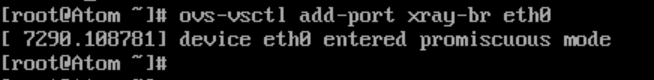

##### <font color=red>(若图片无法加载，请配置本地hosts文件，重新声明DNS，...... 或者直接科学上网！)</font>
# 基于OVS 打通 Container 容器网络
## 1、环境准备
### 1.1 OVS 版本

### 1.2 Docker 版本

### 1.3 CentOS 版本

## 2、开启网络包转发支持
```
echo "net.ipv4.ip_forward=1" >> /usr/lib/sysctl.d/50-default.conf
```
```
systemctl restart network
```
## 3、配置OVS
### 3.1 创建虚拟网桥
```
ovs-vsctl add-br xray-br
```

### 3.2 物理网卡link至虚拟网桥
```
ovs-vsctl add-port xray-br eth0
```

### 3.3 虚拟网桥配置IP
#### 3.3.1 解除原IP绑定
```
ip addr del 10.7.68.34/16 dev eth0
```
#### 3.3.2 配置新IP
```
ip link set xray-br up
```
```
ip addr add 10.7.68.34/16 dev xray-br
```

### 3.4 设置默认路由
```
ip route add default via 10.7.0.1 dev xray-br
```
### 3.5 创建Internal虚拟端口（做为Container的网关）
```
ovs-vsctl add-port xray-br vlan10 -- set interface vlan10 type=internal
ip addr add 192.168.111.1/16 dev vlan10
ip link set vlan10 up
```
```
ovs-vsctl add-port xray-br vlan20 -- set interface vlan20 type=internal
ip addr add 192.168.222.1/16 dev vlan20
ip link set vlan20 up
```


## 4、配置Container
### 4.1 安装ovs-docker工具
```
wget http://github.com/openvswitch/ovs/raw/master/utilities/ovs-docker
```
```
chmod a+x ovs-docker
```
```
mv ovs-docker /usr/bin/
```
### 4.2 创建网络模式为"none"的容器
```
docker run -itd --name xray-1 --privileged --network=none xray-ubuntu:latest /bin/bash
docker run -itd --name xray-2 --privileged --network=none xray-ubuntu:latest /bin/bash
```

### 4.3 配置容器IP
```
ovs-docker add-port xray-br eth0 xray-1 --ipaddress=192.168.111.3/16 --gateway=192.168.111.1
ovs-docker add-port xray-br eth0 xray-2 --ipaddress=192.168.222.3/16 --gateway=192.168.222.1
```

## 5、验证
```
docker exec -it xray-1 /bin/bash

ping 192.168.2.3
```

## 6、恢复网络环境
```
ovs-vsctl del-br xray-br
```
```
systemctl restart network
```

