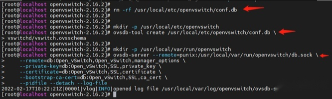

##### <font color=red>(若图片无法加载，请配置本地hosts文件，重新声明DNS，...... 或者直接科学上网！)</font>
# **《初始化安装 Open vSwitch》**

### **0x00 安装包下载链接**
```
https://www.openvswitch.org/releases/openvswitch-3.0.0.tar.gz
```

### **0x01 生成编译文件**
进入解压后的目录，执行
```
./configure
```


### **0x02 Makefile构建**
从执行./configure的目录中执行make，构建Open vSwitch 用户空间以及内核模块：
```
make
```


### **0x03 install安装**
安装openvswitch：
```
make install
```


### **0x04 重新编译安装**
如果构建了内核模块，可以重新编译安装：
```
make modules_install
```


### **0x05 加载到内核**
加载openvswitch到内核模块：
```
/sbin/modprobe openvswitch
```
并检查是否加载成功：
```
/sbin/lsmod | grep openvswitch
```


### **0x06 启动相关服务以及数据库**


启动所有进程：
```
export PATH=$PATH:/usr/local/share/openvswitch/scripts
ovs-ctl start
```


### **0x07 停止OVS进程**
```
ovs-ctl stop
```


### **0x08 移除原有数据库并重新安装**

```
rm -rf /usr/local/etc/openvswitch/conf.db

mkdir -p /usr/local/etc/openvswitch

ovsdb-tool create /usr/local/etc/openvswitch/conf.db ./vswitchd.ovsschema

ovsdb-server --remote=punix:/usr/local/var/run/openvswitch/db.sock \
--remote=db:Open_vSwitch,Open_vSwitch,manager_options \
--private-key=db:Open_vSwitch,SSL,private_key \
--certificate=db:Open_vSwitch,SSL,certificate \
--bootstrap-ca-cert=db:Open_vSwitch,SSL,ca_cert \
--pidfile --detach --log-file
```

### **0x09 初始化数据库，仅在使用 ovsdb-tool 创建数据库后第一次需要**
```
ovs-vsctl --no-waitinit
```

### **0x10 启动主 Open vSwitch 守护进程，并连接到同一个 Unix 域套接字**
```
ovs-vswitchd --pidfile --detach --log-file
```


### **0x11 验证**
```
ovs-vsctl show
```

