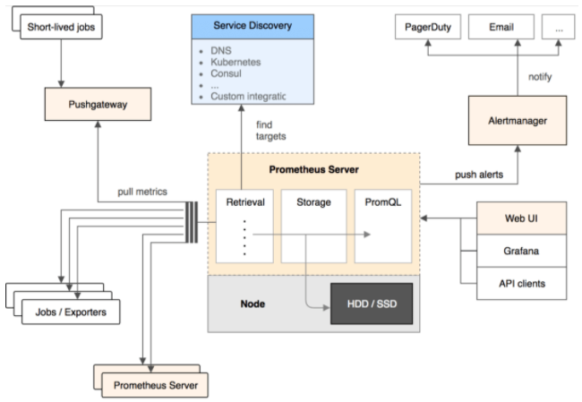
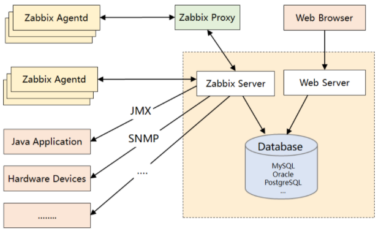

##### <font color=red>(若图片无法加载，请配置本地hosts文件，重新声明DNS，......或者直接科学上网！)</font>
# 记: 基于Ubuntu22.04构建Prometheus+Grafana,实现容器级监控及可视化
## 背景概述: 
鉴于工作原因，前段时间搭建了一套websocket服务，但在实际部署中发现一些问题。由于网络稳定性原因及诸多不可控因素，经常发生ws连接偶发性中断，但服务本身又没有有效的健康检查机制。这样将对服务稳定性造成严重隐患。所以想着通过寻找引入第三方中间件，完成此任务。  
(起初，自己在本地写了个Shell脚本，循环监听进程，但毕竟太Low了，像贴膏药一样，根本拿不上台面，而且一旦Saas部署，可行性并不高)  
此时就想着要能有一套完整的监控解决方案，那该多好。  <br><br/>
## 选型分析：
Prometheus & Zabbix  
首先，观察下二者的结构图 <br><br/>
    
   
### Prometheus：
- 基于Pull模式
- 采用TSDB
- 对应用层监控更加全面
- 支持云环境，自动发现容器，K8S提供对Prometheus的原生支持
- Alter-manager组件提供报警支持
- 时序库方便聚合分析，及UI展示  
- 集群化、持久化存储不方便、网络规划较复杂
### Zabbix：
- 基于Push模式
- 采用RDB
- 有完整的生态圈支持
- 无原生报警组件
- 对聚合数据分析及UI展示，支持欠佳  
### 对比综述：  
Prometheus在场景适配上，力压老牌的Zabbix。抛开功能完备性不谈(报警、聚合分析、数据渲染等)，瓶颈主要在DB。Zabbix默认使用常规的RDB，面对多写少读的真实监控场景，当QPS达到峰值(官方说是单机上限5000台)，RDB在IO处理上，必然影响整个系统的吞吐量，是性能的瓶颈。此时，Prometheus的时序库，完美适配了此种监控场景所需，虽然不及关系库检索时便捷，但重在时效性，碾压了各路SQL、NoSQL队友，使其在该领域脱颖而出。  <br><br/>
并不是说，Zabbix不够优秀，时间拨回到Zabbix出生的那个时代，它的设计绝对是非常前卫的，通吃当时的市场，但同时其也背负了太多历史的包袱。时间的巨轮一直向前滚动，面对新时代海量的数据，RDB自身的局限性，必然被新生代TSDB所取代。  
<br><br/>
  
# Demo
<font color=red size=4>**Operations is not roadshow. Let's do it now.**</font><br>  

### **0x00-环境信息**
```
Master: 152.32.170.211
Slave: 111.230.227.23
Host: Ubuntu-22.04
```
### **0x01-组件包地址**
#### 官方下载地址
```
https://prometheus.io/download/
```
```
https://grafana.com/grafana/download/
```
##### prometheus
```
https://github.com/prometheus/prometheus/releases/download/v2.37.0/prometheus-2.37.0.linux-amd64.tar.gz
```
##### grafana
```
https://dl.grafana.com/enterprise/release/grafana-enterprise_9.0.6_amd64.deb
```
```
https://dl.grafana.com/enterprise/release/grafana-enterprise-9.0.6-1.x86_64.rpm
```
##### alertmanager
```
https://github.com/prometheus/alertmanager/releases/download/v0.24.0/alertmanager-0.24.0.linux-amd64.tar.gz
```
##### blackbox_exporter
```
https://github.com/prometheus/blackbox_exporter/releases/download/v0.22.0/blackbox_exporter-0.22.0.linux-amd64.tar.gz
```
##### consul_exporter
```
https://github.com/prometheus/consul_exporter/releases/download/v0.8.0/consul_exporter-0.8.0.linux-amd64.tar.gz
```
##### graphite_exporter
```
https://github.com/prometheus/graphite_exporter/releases/download/v0.12.3/graphite_exporter-0.12.3.linux-amd64.tar.gz
```
##### haproxy_exporter
```
https://github.com/prometheus/haproxy_exporter/releases/download/v0.13.0/haproxy_exporter-0.13.0.linux-amd64.tar.gz
```
##### memcached_exporter
```
https://github.com/prometheus/memcached_exporter/releases/download/v0.10.0/memcached_exporter-0.10.0.linux-amd64.tar.gz
```
##### mysqld_exporter
```
https://github.com/prometheus/mysqld_exporter/releases/download/v0.14.0/mysqld_exporter-0.14.0.linux-amd64.tar.gz
```
##### node_exporter
```
https://github.com/prometheus/node_exporter/releases/download/v1.4.0-rc.0/node_exporter-1.4.0-rc.0.linux-amd64.tar.gz
```
##### pushgateway
```
https://github.com/prometheus/pushgateway/releases/download/v1.4.3/pushgateway-1.4.3.linux-amd64.tar.gz
```
##### statsd_exporter
```
https://github.com/prometheus/pushgateway/releases/download/v1.4.3/pushgateway-1.4.3.linux-amd64.tar.gz
```
