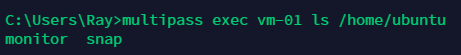
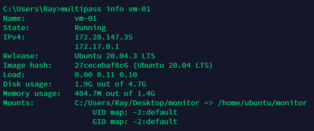
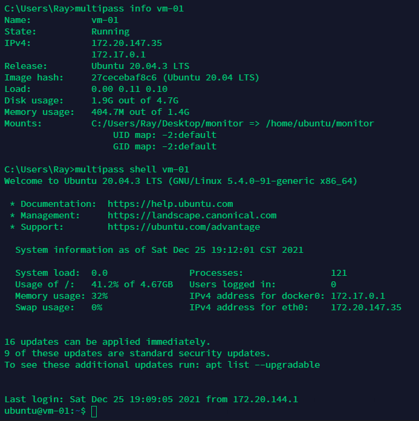
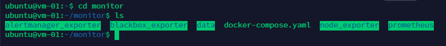
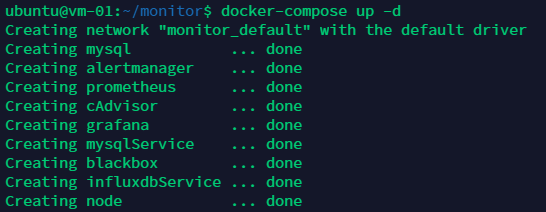
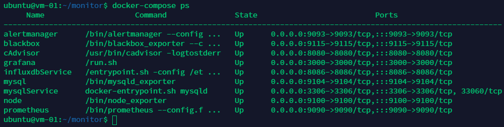

# 《基于Multipass搭建虚拟机，部署容器服务》

### 1、安装Multipass

```
官网下载链接：https://multipass.run/
```

### 2、声明Multipass支持挂载存储

```
multipass set local.privileged-mounts="True"
```

### 3、创建虚机


```
multipass launch -n vm-01 -c 1 -m 1G -d 5G --cloud-init C:\Users\Ray\Desktop\config.yaml 20.04
```

```
-n：虚机名称
-c：CPU核数
-m：内存分配
-d：磁盘分配
--cloud-init：虚机启动后，首先执行的初始化文件
<20.04>：Ubuntu版本
```

### 4、挂载目录




```
multipass mount C:\Users\Ray\Desktop\monitor vm-01:/home/ubuntu/monitor
```

```
multipass exec vm-01 ls /home/ubuntu
```

### 5、查看虚机信息



```
multipass info vm-01
```

### 6、进入虚机



```
multipass shell vm-01
```

### 7、进入挂载目录



```
cd monitor
```

### 8、基于docker-compose，拉起容器





```
docker-compose up -d
docker-compose ps
```


### 9、外部访问，服务可达


```
http://172.20.147.35:8080/
```

### 10、Multipass常用命令

```
创建虚机：multipass launch -n 虚机名称 -c CPU核数 -m 分配内存 -d 分配磁盘 --cloud-init 启动执行的YAML文件 Ubuntu版本
进入虚机：multipass shell 虚机名称
启/停/重启/删除虚机：multipass start/stop/restart/delte 虚机名称
释放虚机：multipass purge
恢复虚机：multipass recover 虚机名称
挂起虚机：multipass suspend 虚机名称
查找镜像：multipass find
查看虚机列表：multipass list/ls
查看虚机信息：multipass info 虚机名称
挂载目录：multipass mount 宿主机目录 虚机名称:虚机目录
卸载目录：multipass umount 虚机名称
传输文件：multipass transfer 主机文件 虚机名称:虚机目录
虚机自动化配置：--cloud-init config.yaml
```

