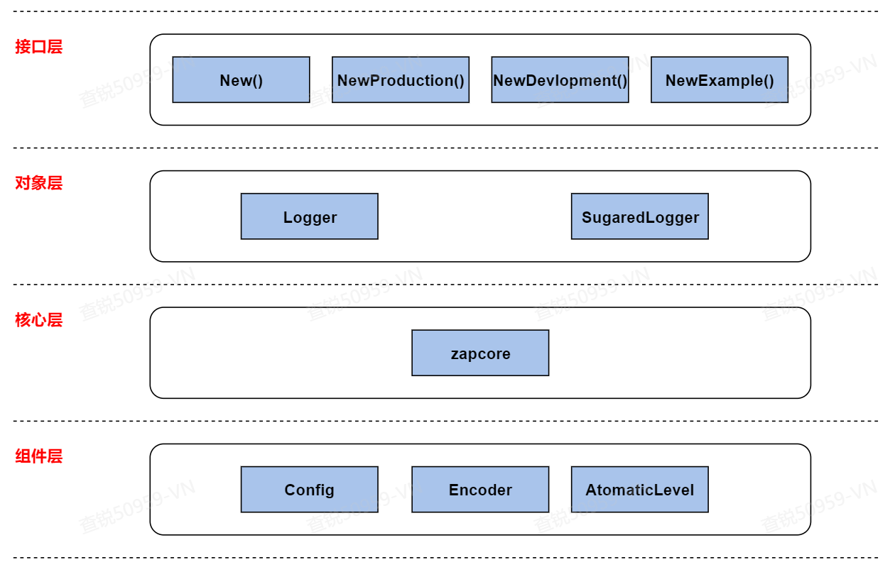
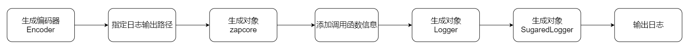
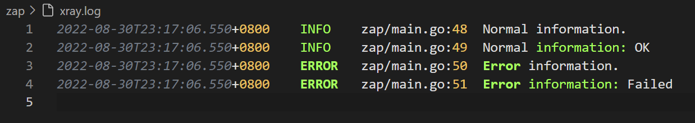

##### <font color=red>(若图片无法加载，请配置本地hosts文件，重新声明DNS，......或者直接科学上网！)</font>
# 《Zap原理及实现》
### 0x00 源码包地址
```
git@github.com:uber-go/zap.git
```

### 0x01 Zap结构
 

| 名称 | 解释 | 源代码 |
| ------ | ------ | ------ |
| New() | 函数；自定义Logger对象 | func New(core zapcore.Core, options ...Option) *Logger { ... } |
| NewProduction() | 函数；打印Info级别以上输出 | func NewProduction(options ...Option) (*Logger, error) { ... } |
| NewDevlopment() | 函数；打印Debug级别以上输出 | func NewDevelopment(options ...Option) (*Logger, error) { ... } |
| NewExample() | 函数；打印Debug级别以上输出；省略时间戳和调用函数 | func NewExample(options ...Option) *Logger { ... } |
| Logger | 对象；只支持强类型的结构化日志记录 | type Logger struct { ... } |
| SugaredLogger | 对象；支持结构化和printf风格的日志记录 | type SugaredLogger struct { ... } |
| zapcore | 定义了zap所依赖的核心接口 |  |
| Config | 	结构体；日志对象的配置信息 | type Config struct { ... } |
| Encoder | 结构体；定义了日志输出的格式 |  |
| AtomaticLevel | 结构体；定义了日志输出的级别 |  |

### 0x02 日志项生成流程


### 0x03 核心函数
| 核心函数 | 功能 | 参数 |
| ------ | ------ | ------ |
| func getEncoderConfig(config *logConfig) zapcore.EncoderConfig { ... } | 生成EncoderConfig对象 | config：日志格式配置 |
| func NewConsoleEncoder(cfg EncoderConfig) Encoder { ... } | 生成Encoder对象 | cfg：日志格式配置对象 |
| func AddSync(w io.Writer) WriteSyncer { ... } | 生成日志输出对象 | w：日志输出路径 |
| func NewCore(enc Encoder, ws WriteSyncer, enab LevelEnabler) Core { ... } | 生成zapcore对象 | enc：编码器，日志写入方式 ws：日志输出路径 enab：日志输出级别 |
| func New(core zapcore.Core, options ...Option) *Logger { ... } | 生成Logger对象 | core：zapcore对象 |

### 0x04 示例代码
```
package main
 
import (
    "os"
 
    "go.uber.org/zap"
    "go.uber.org/zap/zapcore"
)
 
var sugarLogger *zap.SugaredLogger


// InitLogger，初始化Logger对象
func InitLogger() {
    // 生成Encoder对象
    encoder := getEncoder()
    // 生成日志输出
    writeSyncer := getLogWriter()
    // 生成zapcore对象
    core := zapcore.NewCore(encoder, writeSyncer, zapcore.DebugLevel)
 
    // 将调用函数信息记录添加到日志中
    logger := zap.New(core, zap.AddCaller())
    // 生成SugarLogger对象
    sugarLogger = logger.Sugar()
}
 
// getEncoder，获取Encoder对象
func getEncoder() zapcore.Encoder {
    // 初始化encoderConfig
    encoderConfig := zap.NewProductionEncoderConfig()
    // 修改编码器时间输出格式
    encoderConfig.EncodeTime = zapcore.ISO8601TimeEncoder
    // 大写字母记录日志级别
    encoderConfig.EncodeLevel = zapcore.CapitalLevelEncoder
 
    return zapcore.NewConsoleEncoder(encoderConfig)
}
 
// getLogWriter，添加日志输出
func getLogWriter() zapcore.WriteSyncer {
    file, _ := os.Create("./xray.log")
    return zapcore.AddSync(file)
}
 
func main() {
    InitLogger()
    sugarLogger.Info("Normal information.")
    sugarLogger.Infof("Normal information: %s", "OK")
    sugarLogger.Error("Error information.")
    sugarLogger.Errorf("Error information: %s", "Failed")
}
```

### 0x05 运行结果
 
